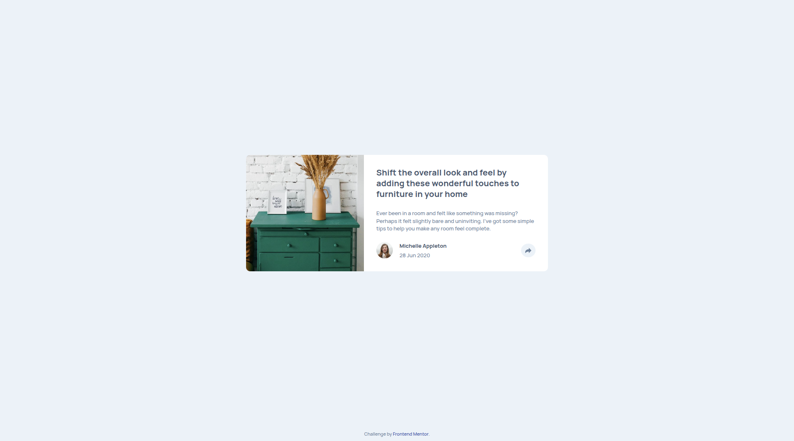

# Frontend Mentor - Article preview component solution

This is a solution to the [Article preview component challenge on Frontend Mentor](https://www.frontendmentor.io/challenges/article-preview-component-dYBN_pYFT).

## Overview

This project reproduces the article preview component design and behavior from Frontend Mentor. The component is responsive and shows a share panel when the user interacts with the share icon.

### Screenshot

### Links

- https://biruchenko.github.io/article-preview-component/

### Features

- **Responsive layout:** Mobile-first styles with a desktop variant
- **Share toggle:** Click the share button to show/hide social links
- **SCSS source:** Source styles in `scss/`, compiled CSS in `styles/`

## Built with

- HTML5
- SCSS (Sass) — compiled to CSS
- Vanilla JavaScript (small interactive behavior)
- Flexbox / CSS Grid for layout

## Acknowledgments

- Challenge by [Frontend Mentor](https://www.frontendmentor.io).
